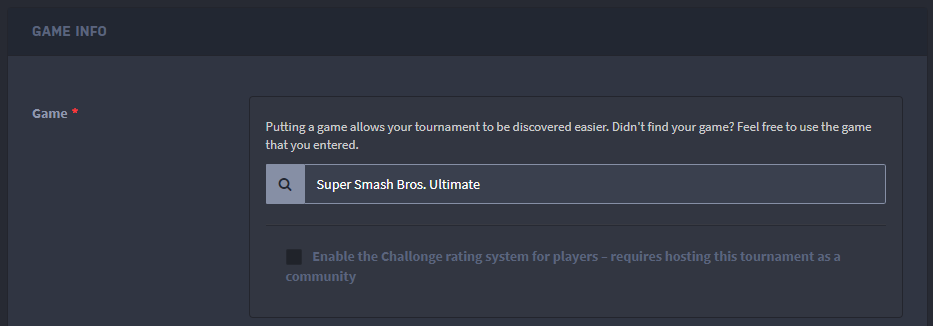
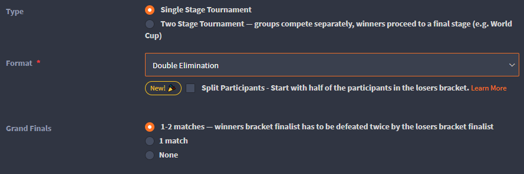
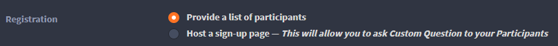
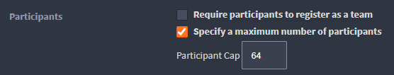
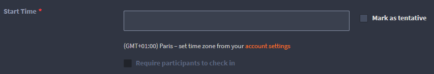

Then, you have to create a tournament on [Challonge](https://challonge.com). There are certain parameters to take into account!

- You have to set the tournament game. If you have a custom config as seen [here](/config-manager/), make sure the name is exactly the same!
  

- Choose a correct format.
  

  The format I have worked on so far is as follows (single stage, double elimination). It should probably work in single elimination, but I've never tested the rest so I don't recommend.
  {: .notice--warning}

- Choose the following option for registrations:
  

- If you want to set a limit of participants, this is where it happens :
  

  The bot respects this limit when registering, but you cannot configure this limit with an order, you must do it on challonge!
  {: .notice--warning}

- Last thing, the tournament launch date.
  
  
  - The configured opening and closing dates for registrations and check-in are calculated from this date, so pay attention.
  - This date is only indicative. Neither Challonge nor the bot has a scheduled launch, the tournament must be started manually with `!start`.
  {: .notice--info}

  **Do not enable participant check-in via Challonge!** The bot manages its own check-in, and checking this option on Challonge will simply result in a 422 error when the bot tries to start the tournament, so keep this disabled!
  {: .notice--danger}

Your tournament is now configured! You can proceed to the next step.
